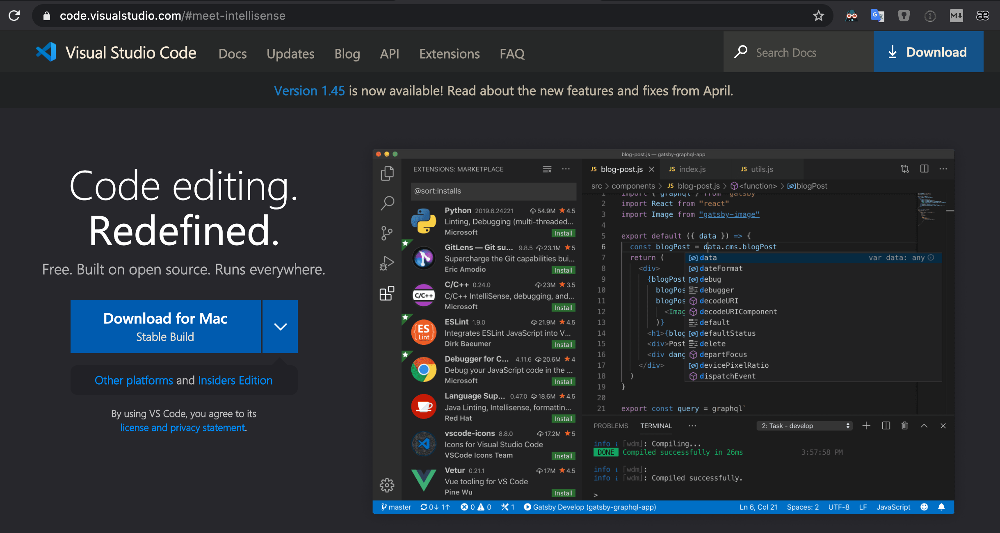

# Getting Started with HTML + CSS
* Here is a compilation of resources for learning how to build your own website
* Goal: Build your own multi-lingual website to teach Japanese + English

## Step Overview
* Step 0 - Tools & Environments
* Step 1 - What is HTML & CSS anyway?
* Step 2 - Alright, lets build a webpage
* Step 3 - Publish on GitHub Page
* Step 4 - Hugo!

## Step 0 - Tools & Environments

### Code Editor - Visual studio code
* What is a Code Editor?
  * i.e. Source-code editor
  * A code editor is a text editor program designed specifically for editing source code of computer programs.
  * Can be a standalone application, in a integrated development environment, or web browser

* What is [Visual studio code](https://code.visualstudio.com/)?
  * i.e. VS code
  * One of the best code editors in the market.
  * Made by Microsoft but free
  * Has powerful extensions to make developing easier.
  * Download: https://code.visualstudio.com/
  * 

* Following are extensions I recommend:
  * [zenkaku](https://marketplace.visualstudio.com/items?itemName=mosapride.zenkaku)
  * [Trailing Spaces](https://marketplace.visualstudio.com/items?itemName=shardulm94.trailing-spaces)
  * [Simple icons](https://marketplace.visualstudio.com/items?itemName=LaurentTreguier.vscode-simple-icons)
  * [Settings Sync](https://marketplace.visualstudio.com/items?itemName=Shan.code-settings-sync)
  * [Replace curly quotes](https://marketplace.visualstudio.com/items?itemName=jinhyuk.replace-curly-quotes)
  * [Rainbow CSV](https://marketplace.visualstudio.com/items?itemName=mechatroner.rainbow-csv)
  * [Markdown All in One](https://marketplace.visualstudio.com/items?itemName=yzhang.markdown-all-in-one)
  * [Live Server](https://marketplace.visualstudio.com/items?itemName=ritwickdey.LiveServer)
  * [Github Markdown Preview](https://marketplace.visualstudio.com/items?itemName=bierner.github-markdown-preview)
  * [DupChecker](https://marketplace.visualstudio.com/items?itemName=jianbingfang.dupchecker)
  * [Community Material Theme](https://marketplace.visualstudio.com/items?itemName=Equinusocio.vsc-community-material-theme)
  * [Code Spell Checker](https://marketplace.visualstudio.com/items?itemName=streetsidesoftware.code-spell-checker)
  * [Code Runner](https://marketplace.visualstudio.com/items?itemName=formulahendry.code-runner)
  * [Bracket Pair Colorizer](https://marketplace.visualstudio.com/items?itemName=CoenraadS.bracket-pair-colorizer)
  * [Beautify](https://marketplace.visualstudio.com/items?itemName=HookyQR.beautify)
  * [:emojisense:](https://marketplace.visualstudio.com/items?itemName=bierner.emojisense)
  * [Auto Close Tag](https://marketplace.visualstudio.com/items?itemName=formulahendry.auto-close-tag)
  * [Auto Rename Tag](https://marketplace.visualstudio.com/items?itemName=formulahendry.auto-rename-tag)

### Git + GitHub
* What is Version Control?
  * It is similar to a ...
    * checkpoint a video game - Where you save a point in the game
    * Google Docs - where you write & save with your team members
  * It provides the following key features
    * **History** - Keeps track of all the changes made to the files over time
    * **Teamwork** - Allows for multiple people working on the same project at the same time
    * **Backup** - Allows for easy file and folder recovery
* What is Git?
  * Git is the actual software that provides the version control to manage software development
  * Started in 2005 as a tool to manage Linux kernel development
  * Free & open-source distributed version control system
* What is GitHub?
  * Github.com is a collaboration platform
  * Web-based git repository hosting service.
    * i.e. hosts the 'remote repositories'
  * Founded in 2008 and now a Microsoft subsidiary
#### Create a GitHub Account
  * Create a GitHub account --> [github.com](https://github.com/)
  * Add 2-Factor Authentication ([help doc](https://help.github.com/en/github/authenticating-to-github/configuring-two-factor-authentication))
    * Go to GitHub Settings:
      * Profile Photo > Settings > Security > Two-factor authentication
      * [github.com/settings/security](https://github.com/settings/security)
  * Install an Authenticator App:
    * e.g. [Authy](https://authy.com/guides/github/) or [1Password](https://support.1password.com/one-time-passwords/)
#### Install GitHub Desktop App
  * By far the easiest way to manage your GitHub repository on Macs & Windows
  * You do not need to use the Command Line to manage your files.
  * Download: https://desktop.github.com/
  * "Focus on what matters instead of fighting with Git. Whether you're new to Git or a seasoned user, GitHub Desktop simplifies your development workflow."

If you want to the git command on your MacOS terminal:
#### Install Git - MacOS
  * Ref: https://git-scm.com/book/en/v2/Getting-Started-Installing-Git
  * Do you have **Homebrew**?
    * If not, install Homebrew first: https://brew.sh/
    * If so, be sure to upgrade it:   `brew update && brew upgrade`
  * Install git with Homebrew:  `brew install git`
  * Confirm installation:       `git --version`
  * Expected result:            `git version 2.26.2`
##### Install Git - MacOS - Potential Issue
  * If you get the following result:  `git version 1.7.10.2 (Apple Git-33)`
  * Try `brew link --force git`
  * Or Try: `export PATH=/usr/local/bin:$PATH`

## Step 1 - What is HTML & CSS anyway?