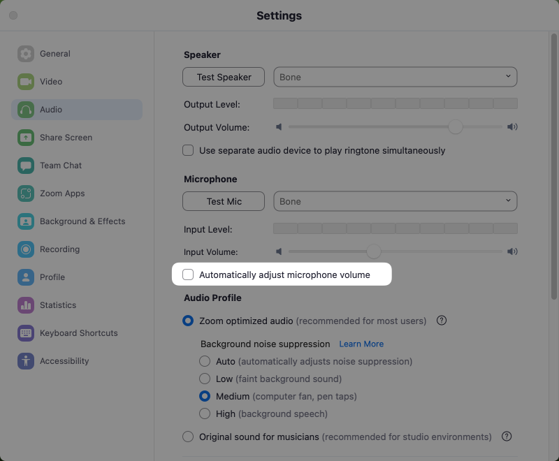

# AfterShokz Open Comm headphone randomly mutes on Zoom calls

## Problem
My Shokz Open Comm headset randomly mutes on Zoom calls.

### Specs
* macOS Monterey 12.6
* MacBook Pro (16-inch, 2019)
* Connection Method: Bluetooth
* Headset: [Shokz OpenComm Bone Conduction Stereo Bluetooth Headset](https://shokz.com/products/opencomm)

## Solution
1. Connect the headset to Mac via Bluetooth
1. Launch Zoom & Open Zoom's Settings
1. Select **Audio**
1. Verify that the **Speaker** and **Microphone** are set to Shokz OpenComm headset
1. Under **Microphone**, uncheck **Automatically adjust microphone volume**
1. Restart Zoom

You are now good to go! 💪

| Zoom Setting Before                                                    | Zoom Setting After                                                    |
| ---------------------------------------------------------------------- | --------------------------------------------------------------------- |
|  |  |

⚡ This is a known issue by Shokz. Macs, Zoom, and Shokz OpenComm headset often experience this problem.
However, this issue is not present when using the headphones with other applications.

## References

[Needing help with Monterey and Aftershokz… - Apple Community](https://discussions.apple.com/thread/253539742?answerId=256647820022#256647820022)

