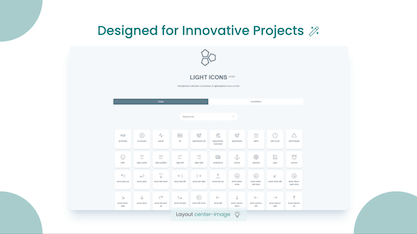

# Notes on using SliDev & lightvue

  * Slide Deck Tool - [slidevjs/slidev: Presentation Slides for Developers (Beta)](https://github.com/slidevjs/slidev)
  * Theme - [lightvue/slidev-theme-light-icons: A light and Elegant theme for Slidev](https://github.com/lightvue/slidev-theme-light-icons)
    * Links - [LightVue | The Emerging UI Component library for Vue](https://lightvue.org/getting-started/light-icons)
  * GitHub Pages Setup - [SlidevをGitHub Pagesで公開](https://zenn.dev/shu1007/articles/c65dee06b29772)

## Slide Deck
  * Markdown - [slides.md](slides.md)

## Commands

### Setup

```bash
npm install @slidev/cli
npm install gh-pages
npm install
```

### To view/ edit

```bash
npm run dev

or

npx slidev --open
```

### To build & upload

```bash
npm run pub
```

### Generate PDF

```bash
npm run export
```

### lightvue Layouts
[lightvue/slidev-theme-light-icons#readme](https://github.com/lightvue/slidev-theme-light-icons#readme)

```yaml
layout: center-image
layout: dynamic-image
layout: image-header-intro
layout: image-left
layout: intro
```

#### Intro `intro`

```yaml
---
layout: intro
image: 'https://source.unsplash.com/collection/94734566/1920x1080'
---
```


#### Intro with icon `image-header-intro`

```yaml
---
layout: image-header-intro
imageHeader: '../assets/images/light-icon-logo.svg'
imageRight: '../assets/images/light-icons-landing.svg'
---
```


#### Dynamic Image `dynamic-image`

```yaml
---
layout: dynamic-image
image: 'https://source.unsplash.com/collection/94734566/1920x1080'
equal: true
left: false
---
```


#### Dynamic Image `dynamic-image`

```yaml
---
layout: dynamic-image 
image: 'https://source.unsplash.com/collection/94734566/1920x1080'
equal: false
left: false
---
```


#### Dynamic Image `dynamic-image`

```yaml
---
layout: dynamic-image 
image: 'https://source.unsplash.com/collection/94734566/1920x1080'
equal: false
left: true
---
```


---

#### Dynamic Image `dynamic-image`

```yaml
---
layout: dynamic-image 
image: 'https://source.unsplash.com/collection/94734566/1920x1080'
equal: true
left: false
---
```


#### Dynamic Image `dynamic-image`

```yaml
---
layout: dynamic-image 
image: 'https://source.unsplash.com/collection/94734566/1920x1080'
upperImage: 'https://source.unsplash.com/collection/94734566/1920x1080'
equal: true
left: false
---
```


#### Image at center `dynamic-image`

```yaml
---
layout: center-image
image: '../assets/images/light-icons-landing2.png'
---
```



#### Dynamic Image `dynamic-image`

```yaml
---
layout: dynamic-image
image: 'https://source.unsplash.com/collection/94734566/1920x1080'
equal: false
left: false
---
```


#### Image at left `left-image`

```yaml
---
layout: left-image
image: '../assets/images/light-vue-landing.svg'
equal: true
---
```


#### Image at center `dynamic-image`

```yaml
---
layout: center-image
---
```


### SliDev Built-in Layouts

#### `center`

Displays the content in the middle of the sreen.

#### `cover`

Used to display the cover page for the presentation, may contain the presentation title, contextualization, etc.

#### `default`

The most basic layout, to display any kind of content.

#### `end`

The final page for the presentation.

#### `fact`

To show some fact or data with a lot of prominence on the screen.

#### `full`

Use all the space of the screen to display the content.

#### `image-left`

Shows an image on the left side of the screen, the content will be placed on the right side.

```yaml
---
layout: image-left
# the image source
image: ./path/to/the/image
# a custom class name to the content
class: my-cool-content-on-the-right
---
```

#### `image-right`

Shows an image on the right side of the screen, the content will be placed on the left side.

```yaml
---
layout: image-right
# the image source
image: ./path/to/the/image
# a custom class name to the content
class: my-cool-content-on-the-left
---
```

#### `image`

Shows an image as the main content of the page.

```yaml
---
layout: image
# the image source
image: ./path/to/the/image
---
```

#### `iframe-left`

Shows a web page on the left side of the screen, the content will be placed on the right side.

```yaml
---
layout: iframe-left
# the web page source
url: https://github.com/slidevjs/slidev
# a custom class name to the content
class: my-cool-content-on-the-right
---
```

#### `iframe-right`
Shows a web page on the right side of the screen, the content will be placed on the left side.

```yaml
---
layout: iframe-right
# the web page source
url: https://github.com/slidevjs/slidev
# a custom class name to the content
class: my-cool-content-on-the-left
---
```

#### `iframe`

Shows a web page as the main content of the page.

```yaml
---
layout: iframe

# the web page source
url: https://github.com/slidevjs/slidev
---
```

#### `intro`

To introduce the presentation, usually with the presentation title, a short description, the author, etc.

#### `none`

A layout without any existent styling.

#### `quote`

To display a quotation with prominience.

#### `section`

Used to mark the beginning of a new presentation section.

#### `statement`

Make an affirmation/statement as the main page content.

#### `two-cols`

Separates the page content in two columns.

```md
---
layout: two-cols
---
# Left
This shows on the left
::right::
# Right
This shows on the right
```
