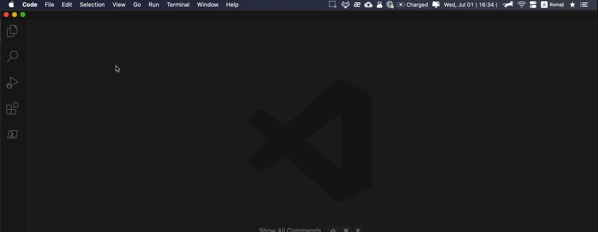

# Compilation of random notes in using VS Code

## Display Whitespace in VS Code
* It is useful to see whitespace in your code editor.
* `editor.renderWhitespace` in the [VS Code Setting](https://code.visualstudio.com/docs/getstarted/settings) governs how to display whitespace. It takes in the following input:
  * `none` - Whitespace will never be displayed.
  * `boundary` - Whitespace will be displayed except for single spaces between words.
  * `section` - (Default) Whitespace will be displayed only on selected text.
  * `all` - All whitespace characters will be displayed all the time.
* I recommend setting `editor.renderWhitespace` to `boundary`.
* To change your VS Code Setting to display whitespace:
  * File > Preference > Setting
  * Search `editor.renderWhitespace`
  * Select `boundary` from the dropdown menu
* Demo gif:
  * 

## Remove Duplicate Lines in VS Code
* Original: [marcosvpj/vscode-remove-duplicate-lines.md](https://gist.github.com/marcosvpj/f04116e5443284ccb5f14f3c443a2d0d)

### If the lines order is not important
1. Sort lines alphabetically
2. Open VS Code's Find Control: `Control` + `F`
3. Toggle "Replace mode"
4. Toggle "Use Regular Expression" (the icon with the **`.*`** symbol)
5. In the **search** field: `^(.*)(\n\1)+$`
6. In the "**replace with**" field,: `$1`
7. Click "Replace All"

### If the lines order *IS* important (can't alphabetically sort)
* In this case, either resort to a solution outside VS Code ([example](https://stackoverflow.com/q/11532157/3258851))
* OR if your document is not very large...
  * **search**: `((^[^\S$]*?(?=\S)(?:.*)+$)[\S\s]*?)^\2$(?:\n)?`
  * **replace with**: `$1`
  * Click the "Replace All" button (*as many times as there are duplicate occurrences*)