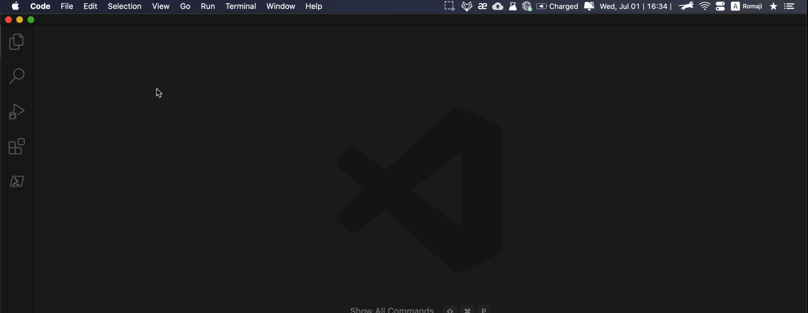

# VS Codeを使用する際のさまざまなメモのまとめ

## VS Codeでの空白の表示
* コードエディターで空白を確認すると便利です。
* [VS Code Setting](https://code.visualstudio.com/docs/getstarted/settings)の `editor.renderWhitespace`は、空白の表示方法を管理します。次の入力を受け取ります。
  * `none` - 空白は表示されません。
  * `boundary` - 単語間の単一のスペースを除いて、空白が表示されます。
  * `section` -（デフォルト）空白は、選択したテキストにのみ表示されます。
  * `all` - すべての空白文字は表示されます。
* `editor.renderWhitespace` を `boundary`に設定することをお勧めします。
* 空白を表示するようにVS Code設定を変更するには：
  * File > Preference > Setting
  * `editor.renderWhitespace`を検索
  * ドロップダウンメニューから `boundary` を選択します
* Demo gif:
  * 
