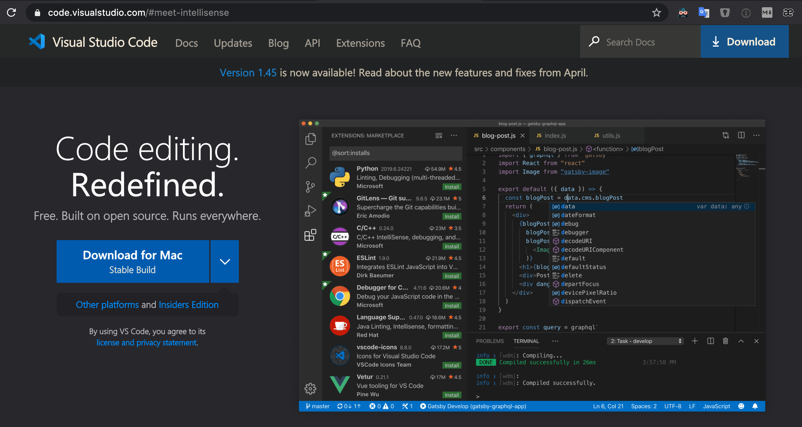

# Getting Started with Visual Studio Code (VS Code)
I highly recommend using Visual studio code as your code editor.

## Outline <!-- omit in toc -->
<!-- markdownlint-disable MD007 -->
* [What is a Code Editor?](#what-is-a-code-editor)
* [What is Visual studio code?](#what-is-visual-studio-code)
* [Recommended VS Code Extensions](#recommended-vs-code-extensions)
<!-- markdownlint-enable MD007 -->

## What is a Code Editor?
  * i.e. Source-code editor
  * A code editor is a text editor program designed specifically for editing source code of computer programs.
  * Can be a standalone application, in a integrated development environment, or web browser

## What is Visual studio code?
  * i.e. VS code
  * One of the best code editors in the market.
  * Made by Microsoft but free
  * Has powerful extensions to make developing easier.
  * Download: [code.visualstudio.com](https://code.visualstudio.com)
  * 

## Recommended VS Code Extensions

| VS Code Extension Link                                                                                                   | Reason                                                                                                               |
| ------------------------------------------------------------------------------------------------------------------------ | -------------------------------------------------------------------------------------------------------------------- |
| [Highlight Bad Chars](https://marketplace.visualstudio.com/items?itemName=wengerk.highlight-bad-chars)                                         | Makes zenkaku-Space (double-byte-whitespace) visible.                                                                |
| [Trailing Spaces](https://marketplace.visualstudio.com/items?itemName=shardulm94.trailing-spaces)                        | Highlights trailing spaces and allows for simple all trailing space delete command.                                  |
| [Settings Sync](https://marketplace.visualstudio.com/items?itemName=Shan.code-settings-sync)                             | Backup & Sync your VS Code settings and Extensions by storing the setting JSON file as a secrete GitHub Gist.        |
| [Replace curly quotes](https://marketplace.visualstudio.com/items?itemName=jinhyuk.replace-curly-quotes)                 | Replaces all curly quotes(`‘`, `’`, `“`, `”`) in a document with straight quotes(`'`, `"`).                          |
| [Rainbow CSV](https://marketplace.visualstudio.com/items?itemName=mechatroner.rainbow-csv)                               | Makes it easier to read and edit CSV and TSV files                                                                   |
| [Markdown All in One](https://marketplace.visualstudio.com/items?itemName=yzhang.markdown-all-in-one)                    | Amazing tool that has all the features you need when writing Markdown files!                                         |
| [Live Server](https://marketplace.visualstudio.com/items?itemName=ritwickdey.LiveServer)                                 | Launch a local development server with live reload feature for static & dynamic pages. Perfect when working on HTML. |
| [Github Markdown Preview](https://marketplace.visualstudio.com/items?itemName=bierner.github-markdown-preview)           | View your Markdown file as they would on GitHub.                                                                     |
| [DupChecker](https://marketplace.visualstudio.com/items?itemName=jianbingfang.dupchecker)                                | Check duplicate lines in the file content or selection, and remove them if you need to keep the unique lines only.   |
| [Community Material Theme](https://marketplace.visualstudio.com/items?itemName=Equinusocio.vsc-community-material-theme) | Makes your VS Code prettier to look at!                                                                              |
| [Code Spell Checker](https://marketplace.visualstudio.com/items?itemName=streetsidesoftware.code-spell-checker)          | Great spell checker for programmers as it works well with camelCase code and keeps false positives pretty low.       |
| [Code Runner](https://marketplace.visualstudio.com/items?itemName=formulahendry.code-runner)                             | Useful in running Python and JavaScript code locally for a quick check.                                              |
| [Bracket Pair Colorizer](https://marketplace.visualstudio.com/items?itemName=CoenraadS.bracket-pair-colorizer)           | Matching brackets are identified with colours.                                                                       |
| [Beautify](https://marketplace.visualstudio.com/items?itemName=HookyQR.beautify)                                         | Beautify javascript, JSON, CSS, Sass, and HTML.                                                                      |
| [:emojisense:](https://marketplace.visualstudio.com/items?itemName=bierner.emojisense)                                   | Autocomplete for emoji                                                                                               |
| [Auto Close Tag](https://marketplace.visualstudio.com/items?itemName=formulahendry.auto-close-tag)                       | Automatically add HTML/XML close tag.                                                                                |
| [Auto Rename Tag](https://marketplace.visualstudio.com/items?itemName=formulahendry.auto-rename-tag)                     | Automatically rename paired HTML/XML tag, same as Visual Studio IDE does.                                            |
| [Markdown Paste](https://marketplace.visualstudio.com/items?itemName=telesoho.vscode-markdown-paste-image)               | Smartly paste images in Markdown with `Markdown Paste` command                                                       |
