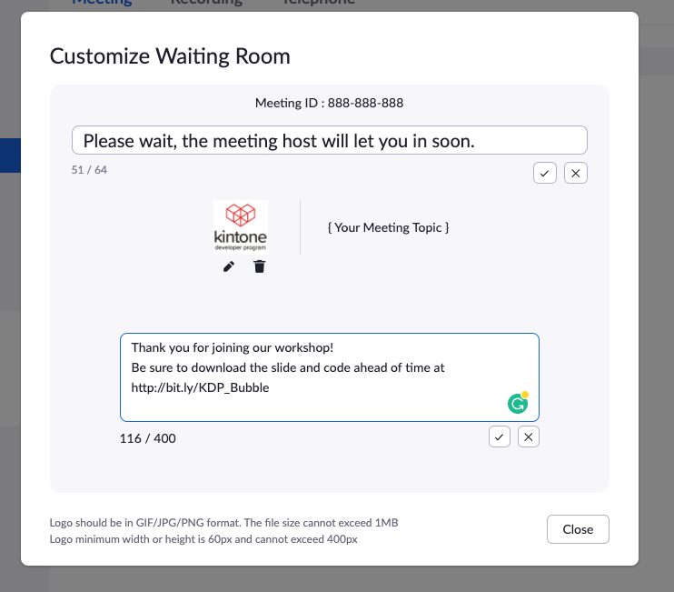

# Notes about Zoom
  * [Zoom](https://zoom.us/)
  * Japanese version -> [Zoom_JP.md](Zoom_JP.md)

## Outline
  * [Enable the following Zoom Webinar settings for Virtual Workshop](#enable-the-following-zoom-webinar-settings-for-virtual-workshop)
  * [Steps to configuring Zoom settings](#steps-to-configuring-zoom-settings)
  * [Useful shortcuts](#useful-shortcuts)
  * [Roles in a webinar | Zoom Help](#roles-in-a-webinar--zoom-help)
  * [Zoom Meeting vs. Zoom Webinar](#zoom-meeting-vs-zoom-webinar)
  * [Zoom's Waiting Rooms Are Not Very Customizable](#zooms-waiting-rooms-are-not-very-customizable)
  * [Getting Attendees' Feedback Over Zoom](#getting-attendees-feedback-over-zoom)
    * [Webinar - Use Post Webinar Survey](#webinar---use-post-webinar-survey)
    * [Meeting - Use Poll](#meeting---use-poll)
  * [Sharing a Video on Zoom - Superior Method](#sharing-a-video-on-zoom---superior-method)

---

## Enable the following Zoom Webinar settings for Virtual Workshop
  * Webinar practice session | [Zoom Doc](https://support.zoom.us/hc/en-us/articles/206316975-Webinar-practice-session#h_f39ba5de-428f-4aed-a962-3741d6543ca6)
    * This allows the hosts to configure their Zoom settings before sharing with attendees.
    * When you are ready, click **Broadcast** to start the webinar and allow attendees to join the webinar.
  * Question & Answer (Q&A) | [Zoom Doc](https://support.zoom.us/hc/en-us/articles/203686015-Getting-Started-with-Question-Answer)
    * Allows for a better experience of attendees asking questions and co-hosts answering them on an individual basis.
    * Once the Webinar has started, allow attendees to see other's questions | See attached screenshot
  * Recoding setting to **record active speaker, gallery view, and shared screen separately** | [Zoom Doc](https://support.zoom.us/hc/en-us/articles/360025561091-Recording-layouts#h_ba887192-78ae-4613-82cb-a7b52d1f4b67)
    * By recording the Webinar without participant's faces, we can share the video publicly

---

## Steps to configuring Zoom settings
  * See attached video
1. Visit [https://cybozu.zoom.us/webinar/list](https://cybozu.zoom.us/webinar/list)
2. Schedule a webinar, or click the title of a webinar that's already scheduled.
   * Click Edit this Webinar.
   * In the Webinar Options section, check the following boxes:
     * Q&A
     * Enable Practice Session
     * Record the Webinar automatically
3. Visit <https://cybozu.zoom.us/profile/setting?tab=recording>
   * Under Cloud recording > enable **Record active speaker, gallery view, and shared screen separately**

---

## Useful shortcuts

| Shortcut              | English                                            | 日本語                                                         |
| --------------------- | -------------------------------------------------- | -------------------------------------------------------------- |
| Command(⌘)+Shift+P    | Pause or resume recording                          | 録音を一時停止または再開する                                   |
| Command(⌘)+Shift+W    | Switch between active speaker view or gallery view | アクティブなスピーカービューまたはギャラリービューを切り替える |
| Command(⌘)+U          | Display/hide Participants panel                    | 参加者パネルの表示/非表示                                      |
| Command(⌘)+Shift+H    | Show/hide In-Meeting Chat Panel                    | 会議中チャットパネルの表示/非表示                              |
| Ctrl+Option+Command+H | Show/hide meeting controls                         | 会議コントロールの表示/非表示                                  |
| Command(⌘)+W          | Prompt to End or Leave Meeting                     | 会議を辞める                                                   |

[Full list of shortcuts](https://support.zoom.us/hc/en-us/articles/205683899)

---

## Roles in a webinar | [Zoom Help](https://support.zoom.us/hc/en-us/articles/360000252726)
  * **Host** of the webinar is the user who the webinar is scheduled under.
    * Has full permissions to manage the webinar, panelists, and attendees.
  * **Alternative Host** are users who have the same permissions as a Host.
    * They are assigned ahead of time & can start meetings.
  * **Co-hosts** share many of the controls that hosts have but cannot start the webinar.
    * The host must assign a co-host and can only be assigned during a meeting, and thus cannot start a meeting.
    * If a host needs someone else to start the webinar --> assign an alternative host.
  * **Panelists** are full participants in a webinar.
    * They can view and send video, screen share, annotate, etc.
    * Host must assign a panelist. --> [Inviting panelists to a webinar](https://support.zoom.us/hc/en-us/articles/115005657826)
  * **Attendees** are view-only participants who can be unmuted if the host chooses.
    * Can only interact with the host and the panelists through the Q&A and the chat.

---

## Zoom Meeting vs. Zoom Webinar
Here is a rundown of the differences between the two.

For more details, refer to the official Help Doc:
[Meeting and webinar comparison – Zoom Help Center](https://support.zoom.us/hc/en-us/articles/115005474943-Meeting-and-webinar-comparison)

TL;DR
  * Webinar's Strength: Simpler interface for attendees, Q&A function, & Post attendee URL
  * Webinar's Weakness: Guests cannot turn on their cameras by default. Need to be promoted...

| Meeting                               | Webinar                                                  |
| ------------------------------------- | -------------------------------------------------------- |
| Use for hosting small to large groups | Use for large events & public broadcasts (50+ attendees) |
| Sales meetings, training sessions     | Town halls, College lecture, Musical events              |
| Free & Paid subscriptions             | Extra cost as Paid Add-on                                |

Comparing the features (Differences)

| Feature            |                                          Meeting                                           |                                                           Webinar                                                            |
| ------------------ | :----------------------------------------------------------------------------------------: | :--------------------------------------------------------------------------------------------------------------------------: |
| Participant roles  |                             Host, Co-host, & **Participants**                              |                                        Host, Co-hosts, **Panelist**, & **Attendees**                                         |
| Audio sharing      |                      All participants can mute/unmute their own audio                      | Only the Host & panelists can mute/unmute their own audio; Attendees join in listen-only mode; Host can unmute the attendees |
| Video sharing      |                                      All participants                                      |                                                    Hosts & Panelists Only                                                    |
| Capacity           | Up to 100 with a free license, up to 1,000 depending on the plan and large meeting add-on. |                                   Up to 100-10,000 participants, depending on the license.                                   |
| Participants list  |                                Visible to all participants                                 |                                                 Visible to host and panelist                                                 |
| Email reminders    |                                            N/A                                             |                                                  If registration is enabled                                                  |
| Chat               |                       In-meeting Chat; Basic text & file attachment                        |                                            Webinar chat; ranking, answering, more                                            |
| Meeting reactions  |                                             ✔                                              |                                                             N/A                                                              |
| Nonverbal feedback |                                             ✔                                              |                                                       Only raise hand                                                        |
| Q&A                |                                            N/A                                             |                                                              ✔                                                               |
| File transfer      |                                             ✔                                              |                                                             N/A                                                              |
| Breakout rooms     |                                             ✔                                              |                                                             N/A                                                              |
| Practice session   |                                            N/A                                             |                                                              ✔                                                               |
| Waiting room       |                                             ✔                                              |                                                             N/A                                                              |
| Paypal integration |                                            N/A                                             |                                                              ✔                                                               |

Following are the same & available to both:
  * [Annotation](https://support.zoom.us/hc/en-us/articles/115005706806)
  * [Screen sharing](https://support.zoom.us/hc/en-us/articles/201362153)
  * [Whiteboard](https://support.zoom.us/hc/en-us/articles/205677665)
  * [Closed captioning](https://support.zoom.us/hc/en-us/articles/207279736)
  * International dial-in numbers
  * Livestream (Facebook, YouTube, Workplace by Facebook, Custom Streaming Service)
  * Polling
  * Recording
  * Registration
  * Require password to join

---

## Zoom's Waiting Rooms Are Not Very Customizable
  * Only a tiny (100 x 100 px) logo can be placed.
    * 
  * Text description can be added, but it is not clickable (users cannot click or copy a link).
  * [Waiting Room | Zoom's Help Doc](https://support.zoom.us/hc/en-us/articles/115000332726-Waiting-Room#h_57118d8b-1498-4c4c-a520-f8a5815930a7)
  * Waiting Room's Setting:
    * `https://cybozu.zoom.us/profile/setting`
    * Meeting > Security > Waiting Room

---

## Getting Attendees' Feedback Over Zoom
### Webinar - Use Post Webinar Survey
  * Allows us to redirect normal attendees to our survey website (or any URL) after they leave the Zoom Webinar. (does not work for panelists)
  * Unfortunately, it does not work for Meetings, only for Zoom Webinars.
  * The biggest drawback to Webinar is that only hosts and panelists can share their video (camera feed).
  * We can promote all the attendees to panelists, but it does not go smoothly.
  * ⚠ Post attendee URL is an alternative, but its performance is inconsistent. Many IT blogs recommend using the Post Webinar Survey method.

### Meeting - Use Poll
  * Create a Zoom Poll to collect feedback on how attendees are doing before the break.
  * [How To Use (In Meeting) Polling in Zoom - YouTube](https://youtu.be/erz4xtQHoVs?t=14)

---

## Sharing a Video on Zoom - Superior Method
1. Download the video in advance
   * I recommend [Folx - Download manager for Mac](https://mac.eltima.com/download-manager.html)
2. On Zoom:
   1. Click **Share Screen**  located in your meeting controls.
   2. Switch to the **Advanced** tab
   3. Then select **Video** 
   4. Navigate to and select the video you wish to share, then click **Open**
   5. The video will now open within Zoom and be visible to attendees!

Zoom Help Doc:
  * 日本語 - [ビデオの共有](https://support.zoom.us/hc/ja/articles/360051673592-Sharing-and-playing-a-video#h_01EPAWQXNJNETMY4S33GB0WST0)
  * English - [Sharing your video](https://support.zoom.us/hc/en-us/articles/360051673592-Sharing-and-playing-a-video#h_01EPAWQXNJNETMY4S33GB0WST0)

Here is a demo of sharing a video on Zoom:
  * 
