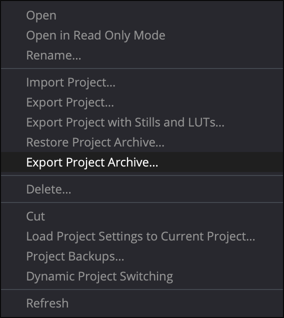
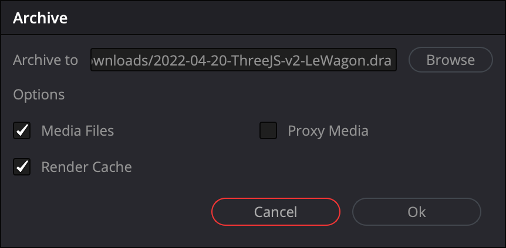
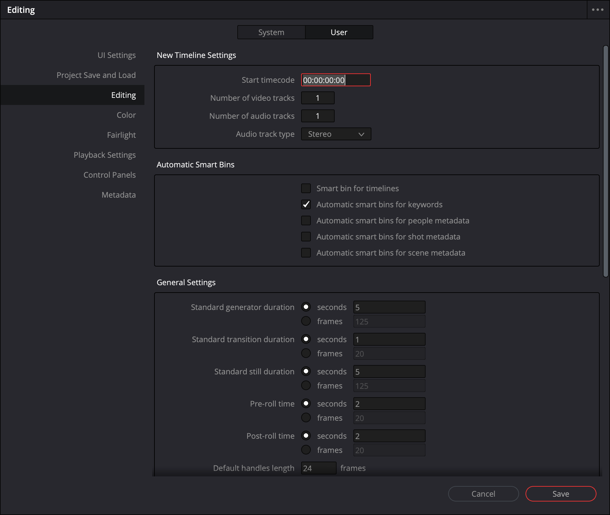
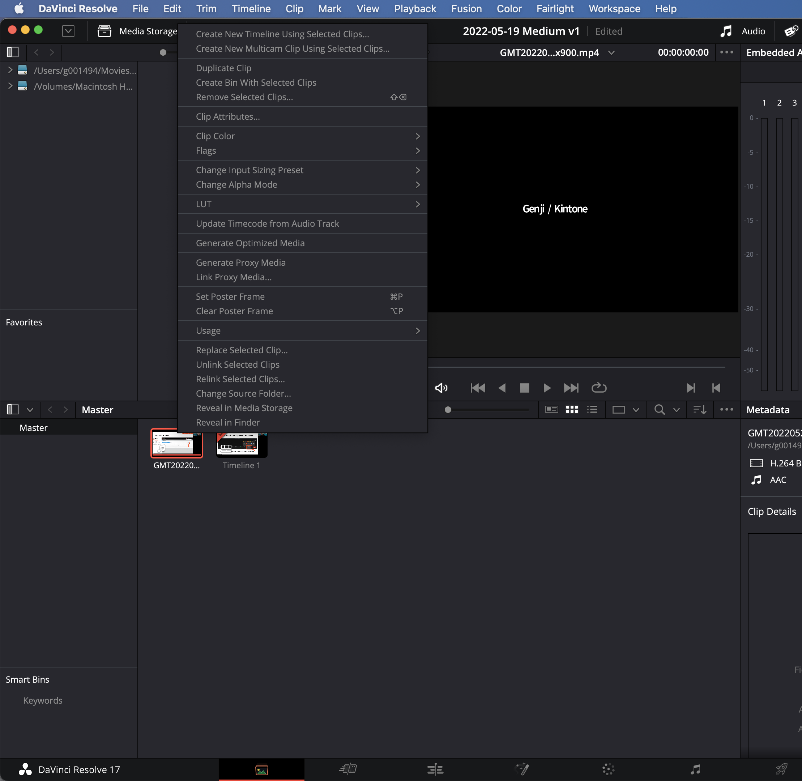
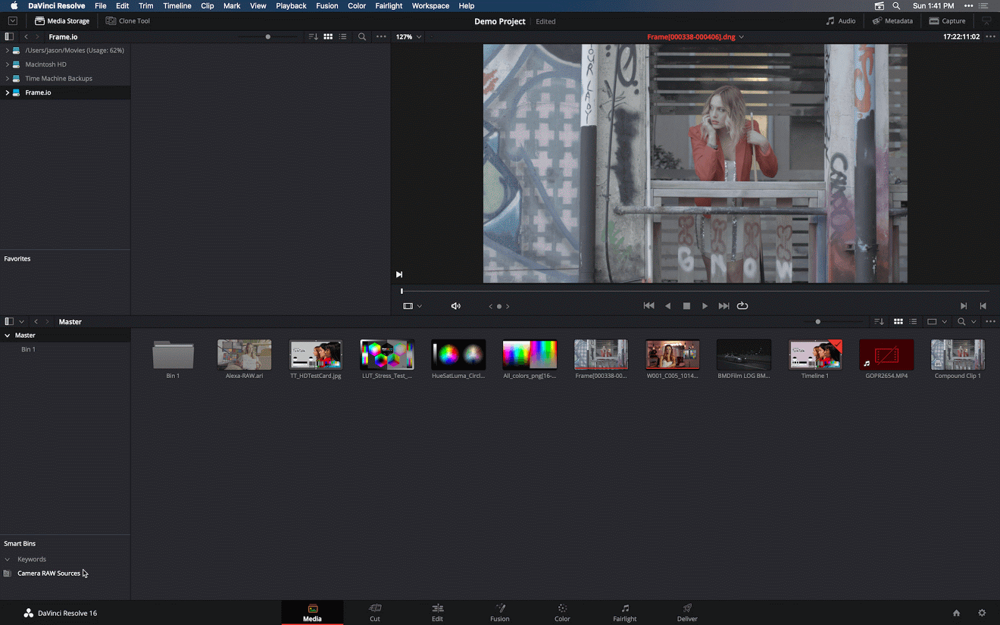
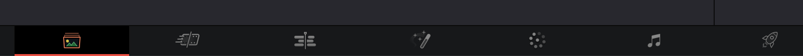
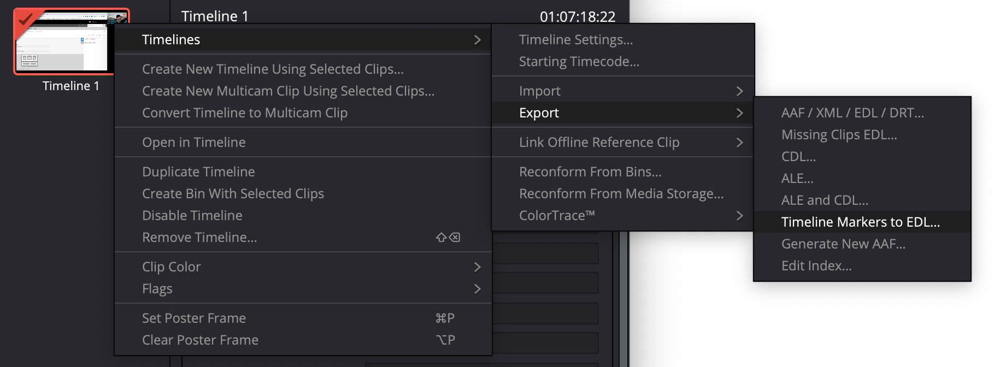

# DaVinci Resolve Tips & Notes

## DaVinci Shortcuts

| Shortcut         | Action                     |
| ---------------- | -------------------------- |
| `K`              | forward                    |
| `J`              | rewind                     |
| `CMD` + `\`      | Cut Clip                   |
| Double click `M` | Add Marker                 |
| `Shift` + `M`    | Edit Marker                |
| Shift + UP Arrow | Jump from Marker to Marker |

## Export DaVinci Resolve Projects

Project > `Export Project Archive` > Included Media --> Full Backup of the project

| Step 1                                                                            | Step 2                                                                                          |
| --------------------------------------------------------------------------------- | ----------------------------------------------------------------------------------------------- |
|  |  |

## Changing DaVinci Resolve's Timecode

## Optimization

| Step 1                                                                        | Step 2                                                    |
| ----------------------------------------------------------------------------- | --------------------------------------------------------- |
|  |  |

## Export Markers for YouTube Video Chapters

Go to Media Tab (Bottom)

* 

Left-Click on `Timeline 1` > Export > Timeline Markers > Timeline Markers to EDL...

* 

Open `Timeline 1.edl` in VS Code
